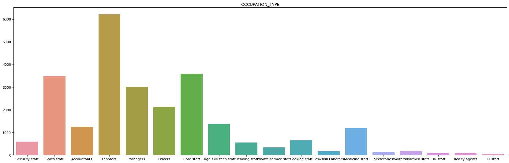
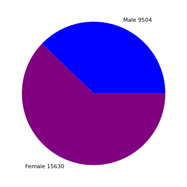
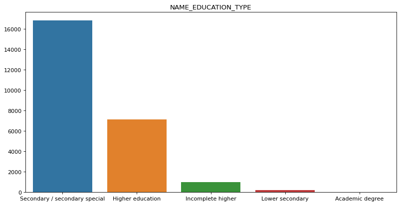
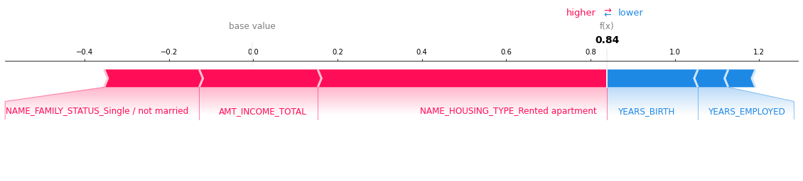
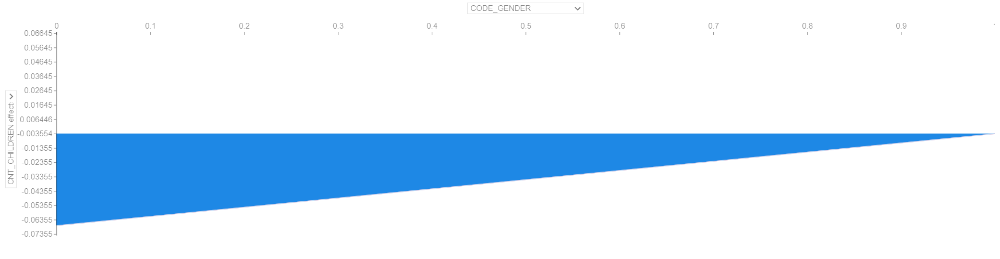
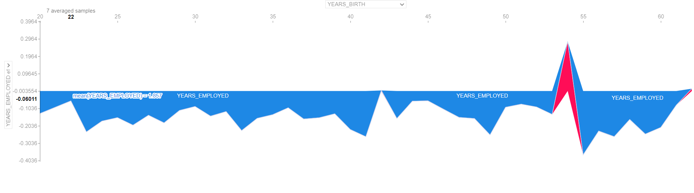

# Fran_Arenas_XAI_credit_card

En este repositorio se busca aplicar herramientas de XAI (Explainable AI) sobre un modelo de predicción de crédito para probar la validez de dichas técnicas.

Para ello se utilizará el dataset encontrado en: https://www.kaggle.com/rikdifos/credit-card-approval-prediction?select=application_record.csv

La principal herramienta para aplicar la explicabilidad de nuestro modelo se trata de la librería SHAP basada principalmente en el Shapley value utilizado en teoría de juegos: https://shap.readthedocs.io/en/latest/index.html

## Dataset

Dispones de dos datasets. En el primero se registran los datos del cliente para una solicitud y en el siguiente se registra el siguimiento de la deuda del cliente.

Para predecir los clientes potencialmente peligrosos se han fusionado los dos dataset para añadir a los datos del cliente la variable de cliente fraudulento que será utilizada como variable objetivo.

Algunos de los datos del ciente son : género, vehículo propio, número de hijos, educación, estatus familiar, tipo de domicilio, tipo de trabajo, etc.

## Modelo

Se ha decidido utilizar el modelo XGBoost. Debido al desbalanceamiento del dataset (corregido parcialmente con la ténica SMOTE) y a la falta de poder computacional para realizar "hyperparameter tunning" no se han obtenido unos resultados demasiado prometedores, pero al no ser la precisión un requisito para la prueba de las técnicas de explicabilidad utilizadas serà una información suficiente.

## Explicabilidad del modelo

En este notebook utilizo principalmente la librería shap

### Explicabilidad en un individuo
 Para ello se puede ver el impacto de cada variable (según los Shapley Values) en la toma de decisión de nuestro modelo. En este caso observamos una muestra de un usuario que ha sido clasificado como cliente de alto riesgo. Se pueden graficar tantas variables como las disponibles del cliente, pero para una visualización más cómoda de los datos solo se han graficado las más relevantes.
 

### Explicabilidad para múltiples individuos de manera simultánea
SHAP ofrece la posibilidad de graficar de manera vertical el gráfico anterior creando así una visualización simultánea en la que se pueden detectar visualmente el impacto de multiples variables en nuestro modelo. Esta herramienta es interactiva, por lo que en apartado de recursos se encuentra un archivo html con el cual se puede visualizar información diversa. 

El principal problema de esta herramienta es que tiene un coste computacional elevado, por lo que representar un número significativo de muestras será necesario disponer de un hardware adecuado. En este caso se han utilizado 2000 muestras (de un total de 25134).

Es útil principalmente para variables con valores continuos, pero debido a los datos de los cuales disponemos la mayoría de las capturas interesantes son de valores discretos.

Algunas capturas de pantalla interesantes sobre la gráfica:

Aquí podemos ver como la variable hijos tiene un impacto superior en mujeres que en hombres (esto se debe probablemente a que las mujeres con 0 hijos tengan un impacto fuerte sobre la decisión, por lo que la relación entre ambas variables se incrementa)

En el gráfico anterior se puede observar como a la edad de 54 años se observa un pico en el impacto con la variable años trabajados. Al ser tan acentuado en los 54 años en comparación con otros años cercanos nos indica que probablemente sea un sesgo del modelo.

### Variables con más impacto en el modelo

impact.png

En el gráfico anterior se puede observar rápidamente las variables con un mayor impacto en el modelo, aunque se puede hacer un estudio más exaustivo de los valores de Shapley expuesto en la siguiente sección.

### Valores de Shapley y detección de sesgos
Mediante una función propia del notebook asociado a este repositorio se ha mostrado el impacto de cada valor posible de cada "feature" de nuestro dataset.

A continuación se muestran algunos ejemplos así como conclusiones extraidas del análisis.

Feature: CODE_GENDER	 value: Men	 Impact: -0.14596430979669409
Feature: CODE_GENDER	 value: Women	 Impact: -0.23019137926356806

Según los valores mostrados el modelo tiende a asignar un riesgo mayor a los clientes masculinos.

Feature: NAME_EDUCATION_TYPE	 value: Secondary / secondary special	 Impact: -0.17723326800877512
Feature: NAME_EDUCATION_TYPE	 value: Higher education	 Impact: -0.15397021899685898
Feature: NAME_EDUCATION_TYPE	 value: Incomplete higher	 Impact: -0.1648118817354135
Feature: NAME_EDUCATION_TYPE	 value: Lower secondary	 Impact: -0.19202636333834877
Feature: NAME_EDUCATION_TYPE	 value: Academic degree	 Impact: 0.31512815185955595

Los valores anteriores nos muestran que las personas con un grado académico tienen una posibilidad bastante más elevada de ser catalogados como clientes de alto riesgo. Este sesgo en nuestro modelo se deba probablemente a que el número de clientes con un grado acádemico es muy bajo (14) en comparación con el tamaño de nuestros datos (+25000) por lo que se ve claramente que hemos detectado un sesgo creado por la distribución de datos dispar en nuestro modelo.

### Gráficas de interacción de impacto entre variables 
