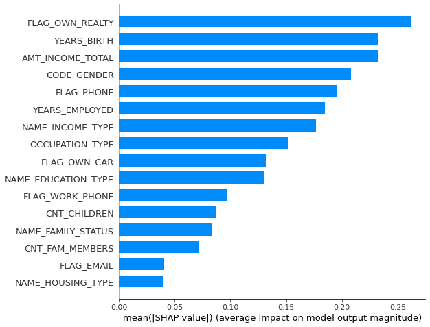
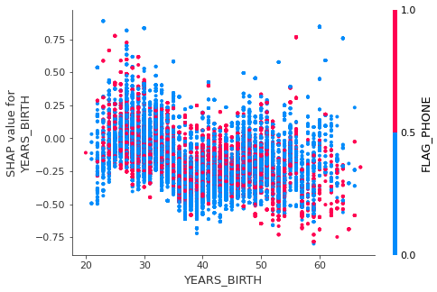

# Fran_Arenas_XAI_credit_card

En este repositorio se busca aplicar herramientas de XAI (Explainable AI) principalmente utilizando SHAP. Para ello se aplicarán diversas funcionalidades de la librería sobre un modelo XGBoost encargado de predecir clientes potenciales a la hora de asignar un crédito.

Dataset utilizado: https://www.kaggle.com/rikdifos/credit-card-approval-prediction?select=application_record.csv

SHAP: https://shap.readthedocs.io/en/latest/index.html

## Configuración del notebook y datos de telegram

El notebook cuenta con una primera celda en la cual se pueden seleccionar los modelos a ejecutar así como la forma de descarga de los resultados (telegram o descarga local)

En caso de seleccionar telegram, se enviará un mensaje con los csv correspondientes al grupo cuya id sea la asignada a la variable id_telegram. Para el envío de csv se usa el bot @Arenaspython disponible públicamente.

Enlace a grupo público para la descarga de resultados en telegram: https://t.me/joinchat/EdijlVvAWLUxMGQ0 id = 507673519

## Dataset

Existen dos datasets. En el primero se registran los datos del cliente para una solicitud y en el siguiente se registra el siguimiento de la deuda del cliente.

Para predecir los clientes potencialmente peligrosos se han fusionado los dos dataset para añadir a los datos del cliente la variable de cliente fraudulento que será utilizada como variable objetivo.

Algunos de los datos del ciente son : género, vehículo propio, número de hijos, educación, estatus familiar, tipo de domicilio, tipo de trabajo, etc.

### Rango de valores
Feature: index	 valores: 2 to 36456

Feature: CODE_GENDER	 valores: ['M' 'F']

Feature: FLAG_OWN_CAR	 valores: ['Y' 'N']

Feature: FLAG_OWN_REALTY	 valores: ['Y' 'N']

Feature: CNT_CHILDREN	 valores: 0 to 19

Feature: AMT_INCOME_TOTAL	 valores: 27000.0 to 1575000.0

Feature: NAME_INCOME_TYPE	 valores: ['Working' 'Commercial associate' 'State servant' 'Student' 'Pensioner']

Feature: NAME_EDUCATION_TYPE	 valores: ['Secondary / secondary special' 'Higher education' 'Incomplete higher','Lower secondary' 'Academic degree']

Feature: NAME_FAMILY_STATUS	 valores: ['Married' 'Single / not married' 'Civil marriage' 'Separated' 'Widow']

Feature: NAME_HOUSING_TYPE	 valores: ['House / apartment' 'Rented apartment' 'Municipal apartment' 'With parents' 'Co-op apartment' 'Office apartment']

Feature: FLAG_MOBIL	 valores: 1 to 1

Feature: FLAG_WORK_PHONE	 valores: 0 to 1

Feature: FLAG_PHONE	 valores: 0 to 1

Feature: FLAG_EMAIL	 valores: 0 to 1

Feature: OCCUPATION_TYPE	 valores: ['Security staff' 'Sales staff' 'Accountants' 'Laborers' 'Managers' 'Drivers' 'Core staff' 'High skill tech staff' 'Cleaning staff' 'Private service staff' 'Cooking staff' 'Low-skill Laborers' 'Medicine staff' 'Secretaries' 'Waiters/barmen staff' 'HR staff' 'Realty agents' 'IT staff']

Feature: CNT_FAM_MEMBERS	 valores: 1.0 to 20.0

Feature: bad_client	 valores: 0 to 1

Feature: YEARS_BIRTH	 valores: 20 to 67

Feature: YEARS_EMPLOYED	 valores: 0 to 43

### Gráficas

## Modelo

Se ha decidido utilizar el modelo XGBoost. Debido al desbalanceamiento del dataset (corregido parcialmente con la ténica SMOTE) y a la falta de poder computacional para realizar "hyperparameter tunning" no se han obtenido unos resultados demasiado prometedores, pero al no ser la precisión un requisito para la prueba de las técnicas de explicabilidad utilizadas serà una información suficiente.

## Explicabilidad del modelo

En este notebook utilizo principalmente la librería shap

### Explicabilidad en un individuo
 Para ello se puede ver el impacto de cada variable (según los Shapley Values) en la toma de decisión de nuestro modelo. En este caso observamos una muestra de un usuario que ha sido clasificado como cliente de alto riesgo. Se pueden graficar tantas variables como las disponibles del cliente, pero para una visualización más cómoda de los datos solo se han graficado las más relevantes.
 

### Explicabilidad para múltiples individuos de manera simultánea
SHAP ofrece la posibilidad de graficar de manera vertical el gráfico anterior creando así una visualización simultánea en la que se pueden detectar visualmente el impacto de multiples variables en nuestro modelo. Esta herramienta es interactiva, por lo que en apartado de recursos se encuentra un archivo html con el cual se puede visualizar información diversa. 

El principal problema de esta herramienta es que tiene un coste computacional elevado, por lo que representar un número significativo de muestras será necesario disponer de un hardware adecuado. En este caso se han utilizado 2000 muestras (de un total de 25134).

Es útil principalmente para variables con valores continuos, pero debido a los datos de los cuales disponemos la mayoría de las capturas interesantes son de valores discretos.

Algunas capturas de pantalla interesantes sobre la gráfica:

Aquí podemos ver como la variable hijos tiene un impacto superior en mujeres que en hombres (esto se debe probablemente a que las mujeres con 0 hijos tengan un impacto fuerte sobre la decisión, por lo que la relación entre ambas variables se incrementa)

En el gráfico anterior se puede observar como a la edad de 54 años se observa un pico en el impacto con la variable años trabajados. Al ser tan acentuado en los 54 años en comparación con otros años cercanos nos indica que probablemente sea un sesgo del modelo.

### Variables con más impacto en el modelo

En el gráfico anterior se puede observar rápidamente las variables con un mayor impacto en el modelo, aunque se puede hacer un estudio más exaustivo de los valores de Shapley expuesto en la siguiente sección.

### Valores de Shapley y detección de sesgos
Mediante una función propia del notebook asociado a este repositorio se ha mostrado el impacto de cada valor posible de cada "feature" de nuestro dataset.

A continuación se muestran algunos ejemplos así como conclusiones extraidas del análisis.

Feature: CODE_GENDER	 value: Men	 Impact: -0.14596430979669409

Feature: CODE_GENDER	 value: Women	 Impact: -0.23019137926356806

Según los valores mostrados el modelo tiende a asignar un riesgo mayor a los clientes masculinos.

Feature: NAME_EDUCATION_TYPE	 value: Secondary / secondary special	 Impact: -0.17723326800877512

Feature: NAME_EDUCATION_TYPE	 value: Higher education	 Impact: -0.15397021899685898

Feature: NAME_EDUCATION_TYPE	 value: Incomplete higher	 Impact: -0.1648118817354135

Feature: NAME_EDUCATION_TYPE	 value: Lower secondary	 Impact: -0.19202636333834877

Feature: NAME_EDUCATION_TYPE	 value: Academic degree	 Impact: 0.31512815185955595

Los valores anteriores nos muestran que las personas con un grado académico tienen una posibilidad bastante más elevada de ser catalogados como clientes de alto riesgo. Este sesgo en nuestro modelo se deba probablemente a que el número de clientes con un grado acádemico es muy bajo (14) en comparación con el tamaño de nuestros datos (+25000) por lo que se ve claramente que hemos detectado un sesgo creado por la distribución de datos dispar en nuestro modelo.

### Interacción de impacto entre variables 

Otra posibilidad es mostrar una gráfica multivariable (utilizando el color para representar una de las variables) mostrando el impacto en el eje Y.
A continuación podemos observar un ejemplo:

Con esa gráfica podemos observar que las personas más jóvenes tienen más probabilidad de ser clientes de alto riesgo.

En la carpeta imágenes hay más gráficas disponibles

## Otros modelos

En el código adjunto se pueden observar otros dos modelos: Decision Tree y Multilayer Perceptron.

La librería SHAP está optimizada actualmente para modelos basados en árboles, por este motivo el modelo MLP ha tenido que calcular sus Shapley Values sobre una submuestra.

Al ser una técnica Post Hoc es aplicable a cualquier modelo, incluso podemos crear uno totalmente personalizado y pasar como argumento para calcular los Shapley values una función encargada de hacer las predicciones.

### Conclusiones

Como podemos observar en el repositorio, la utilización de los valores de Shapley mediante la librería SHAP nos aporta una herramienta de explicabilidad bastante potente a la hora de analizar nuestros modelos y detectar sesgos de estos.

Pros:
- Gran ayuda a la hora de analizar las decisiones del modelo así como para detectar posibles sesgos
- Gráficas interactivas en HTML

Contras:
- Realizar este análisis es computacionalmente costoso en datasets grandes debido al cómputo de los Shapley Values.
- Es necesario tener un conocimiento técnico mínimo (sobretodo en Shapley Values) para poder interpretar los valores y trabajar con las herramientas proporcionadas
- Algunas funciones de la librería SHAP no están implementadas todavía (como por ejemplo implementar matplotlib con gráficas multivariable)
- Para una interpretación correcta de los datos es recomendable no utilizar "One Hot encoding" ni escalar los datos. Además, en valores discretos las gráficas pueden mostrar visualizaciones poco efectivas por lo que el rendimiento óptimo de estas se obtiene solo con variables continuas.
- Documentación mejorable
